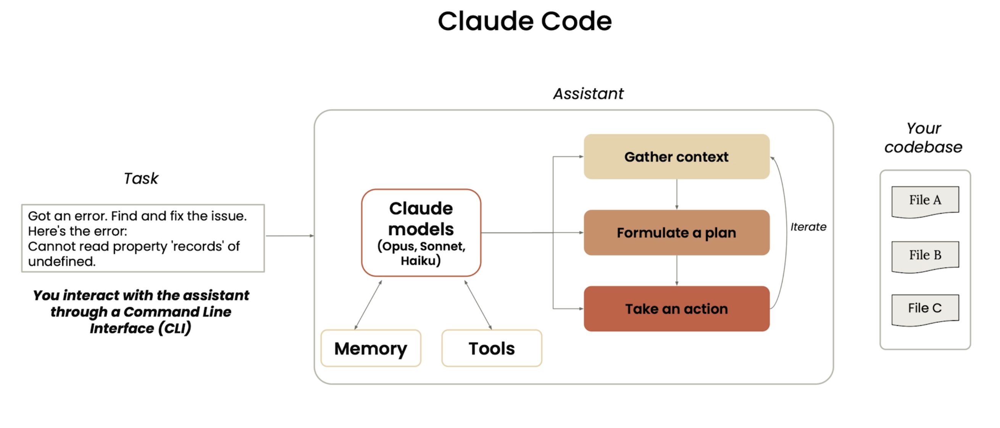

# 1. What are Agents: 

    Agents consists of: 
        - An LLM Model 
        - Tools 
        - Memory
        - A set of rules that define how the agent uses the tools and model to achieve a goal. 
        - Tools can be: 
            - Bedrock models 
            - External APIs 
            - Custom code 
            - Data sources 
        - Enviroment to run these tools . These include: Gather context (Scope), formulate a plan, and take action.  
    - Example Claude Code : 
  

# 2. here are some built in tools in Claude Code: 
   ()

# 3. For some of the latest agents they dont need to index the entire codebase meaning: 
    - the code base will remain local. 
    - Uses something called as an agentic search

