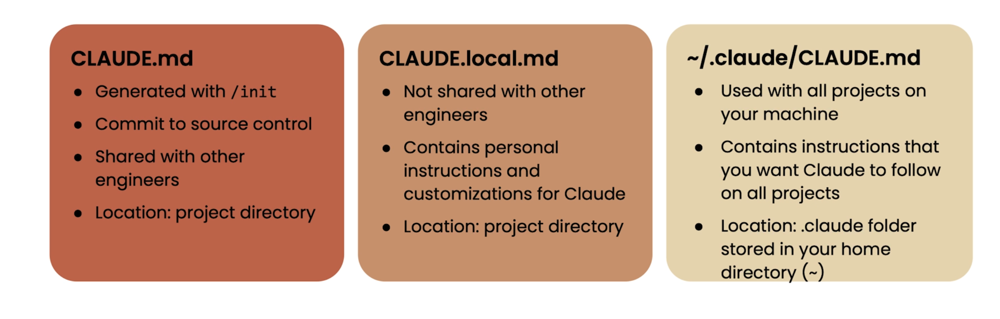

# 1. Installing Claude Code: 
    - Install Node.js, then run:
    - npm install -g @anthropic-ai/claude-code
    - more details are in my notes on NPM_ClaudeCode txt file 
    - to simply run post installation type claude in terminal2

# 2. Claude Code info:
Working Directory 
  L /Users/shivibhatia/Documents/Self/A_Docs/Codes/AWS/Bedrock/ClaudeProjects/FirstClaudeCode-Project

 Account • /login
  L Login Method: Claude Max Account
  L Organization: shivipmp82@gmail.com's Organization
  L Email: shivipmp82@gmail.com

 Memory • /memory
  L project: CLAUDE.md. . md file is used as a memory in claude code 

 Model • /model
  L Default Opus 4.1 for up to 20% of usage limits, then use Sonnet 4 (currently Opus)

  # Change Model type in agent : 
  - claude --model claude-3-5-sonnet-latest

  # Type of md files 
  

  # 3, By default when claude code is installed it does not have a set up file we need to create one: 
    - Initialize Claude Code settings:claude-code configure if we are doing an api authentication else if we do it via email through claude website we dont need to run this command. 

    # 4. Some imp helper menu: 
    ## 4.1 Main Options : 
     ### 1. 
        - p, --print (Non-interactive mode)
        - Purpose: Run Claude without entering interactive chat mode
        - How it works: You provide a prompt directly in the command line and get a single response
        - Use cases:
            - Scripting and automation
            - Batch processing multiple files
            - quick one-off tasks
        - Example usage: claude -p "Explain this Python function" < myfile.py
        - claude --print "Generate a README for this project"
        - claude -p "What's wrong with this code?" --add-dir ./src
    ### 2. -c, --continue (Continue last conversation)
        - Purpose: Resume your most recent Claude Code session
        - How it works:Loads the last conversation state with full context
        - Context preservation:
            - Remembers all previous messages
            - Maintains file references
            - Keeps project understanding
            - Preserves any ongoing tasks
        - Use cases:
            - Continuing complex debugging sessions
            - Long coding sessions across breaks
            - Building on previous analysis
        - Example workflow:
            - Start: claude (work on a feature)
            - Pause: Ctrl+D (go get coffee) or even EXIT 
            - Resume: claude -c (continue working)

    ### 3. -r, --resume (Resume specific conversation)
    - Purpose: Restart a particular conversation by ID
    - How it works: Each Claude session gets a unique identifier stored locally
    - Finding conversation IDs:
        - Use claude conversations to list all sessions
        - Each shows timestamp and brief description
        - Pick specific ID to resume
    - Use cases:
        - Returning to older project discussions
        - Switching between different projects
        -Reviewing previous solutions

    - Example:
        -claude conversations  # Lists: "Aug 9: Python API debugging (ID: abc123)"
        - claude -r abc123      # Resumes that specific session

    ### 4. --model (Choose Claude model)
        - Available models:
        - sonnet (default): Fast, efficient, good for most tasks
        - opus: Most capable, slower, expensive, best for complex problems
        - haiku: Fastest, least expensive, good for simple tasks

    ### 5. --add-dir (Add additional directories)
    - Purpose: Grant Claude access to directories outside current working directory
    - Security: Claude normally only accesses your current project folder
    - Use cases:
        - Referencing shared libraries
        - Accessing configuration files in parent directories
        - Including documentation from other folders
    - Examples:
        - bashclaude --add-dir ../shared-utils --add-dir ~/config
        - claude --add-dir /usr/local/lib/python3.9  # System libraries
        - Security note: Only add trusted directories as Claude can read/modify files

    ### 6. - claude config (Manage configuration)
        - Subcommands available:

        - claude config show: Display current settings
        - claude config set key value: Change specific settings
        - claude config reset: Reset to defaults
        - claude config backup: Save current config
        - claude config restore: Restore from backup

        - Configurable settings:

        - Default model preference
        - File access permissions
        - Response formatting
        - Conversation history limits
        - Tool permissions
        -Directory access rules

    - Examples:
        - claude config show  # View all settings
        - claude config set default_model opus  # Change default model
        - claude config set max_history 100     # Limit conversation history

### 7. claude mcp (Configure MCP servers)
    - MCP (Model Context Protocol): Allows Claude to connect to external services
    - What it enables:

        - Database connections
        - API integrations
        - File system access beyond local
        - Custom tool integration
        - Third-party service connections

    - Common MCP servers:

        - Database connectors (PostgreSQL, MySQL)
        - Cloud service APIs (AWS, GCP, Azure)
        - Development tools (Docker, Kubernetes)
        - File systems (SMB, FTP, S3)

    - Setup process:
        - claude mcp list         # Show available MCP servers
        - claude mcp install db   # Install database connector
        - claude mcp configure    # Set up connections
        - claude mcp test         # Verify connections work

### 8.  claude setup-token (Authentication setup)
    - Purpose: Configure API authentication methods
    - Authentication types:

        - API keys (for programmatic access)
        - Email/password (interactive use)
        - OAuth tokens (enterprise)
        - Session tokens (temporary)

    - When needed:

        - First time setup
        - Switching between accounts
        - Token expiration
        - Access level changes

    - Process:

    # Prompts for:
         - Authentication method
         - Credentials entry
         - Permission levels
         - Token storage location

### 9. claude update (Update Claude Code)
    - What it checks:

        - Latest Claude Code version
        - Breaking changes
        - New features
        - Security patches
        - Compatibility issues

    - Update process:

        - Downloads latest version
        - Backs up current config
        - Migrates settings
        - Tests functionality
        - Rolls back if issues occur

    - Examples:
        - claude update           # Check and install updates
        - claude update --check   # Check without installing
        - claude update --force   # Force update even if risky

    - Permission Options
    - --allowedTools (Specify allowed tools)
    - Purpose: Whitelist specific tools Claude can use
    - Available tools:

        - Bash: Terminal commands
        - Read: File reading
        - Write: File modification
        - Search: Code searching
        - WebBrowse: Internet access
        - ImageView: Image analysis

    - Examples:
        - claude --allowedTools "Bash,Read"        # Only bash and file reading
        - claude --allowedTools "Read,Write,Search" # File operations and search only

    - **--disallowedTools (Deny specific tools)**
        - Purpose: Blacklist dangerous or unwanted tools
            - Common restrictions:

            - Bash: Prevent terminal access
            - Write: Read-only mode
            - WebBrowse: Offline only
            - ImageView: No image processing

        - Examples:
            - claude --disallowedTools "Bash"          # No terminal commands
            - claude --disallowedTools "Write,Bash"    # Read-only, no terminal

    - --permission-mode (Set permission mode)
        -  Available modes:

            - plan: Claude explains what it will do before acting
            - acceptEdits: Auto-approve file modifications
            - interactive: Ask permission for each action
            - restricted: Minimal permissions
            - full: Maximum permissions

        - Mode details:

            - plan: Shows step-by-step plan, asks for approval before execution
            - acceptEdits: Automatically applies code changes without asking
            - interactive: Prompts before each file read/write/command
            - restricted: Only allows safe, read-only operations
            - full: Allows all operations without restrictions

        - Examples:
            - claude --permission-mode plan         # See plans before execution
            - claude --permission-mode acceptEdits  # Auto-apply code changes
            - claude --permission-mode interactive  # Ask before each action

### 10. Interactive Session Commands
    - /help
        - Purpose: Show available commands within Claude session
        - Categories:

            - File operations
            - Code analysis
            - Project management
            - Session control

        - /status
            - Shows:

            - Current project directory
            - Active permissions
            - Model in use
            - Tool availability
            - Session statistics

        - /exit or /quit
            - Purpose: End current session cleanly
            - What happens:

            - Saves conversation history
            - Writes any pending files
            - Cleans up temporary data
Returns to terminal

