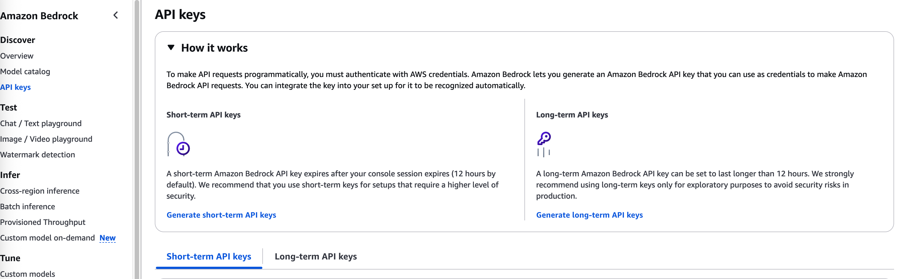

1. Amazon Bedrock API keys feature is actually a parallel authentication mechanism — separate from the normal AWS IAM users, roles, and access keys
2. Who uses it: Intended for developers and external apps that only need Bedrock.
3. How it works:
    - You generate an API key directly in the Bedrock console.
    - The key can be used just like OpenAI API keys — pass it in the request header (x-api-key).
    - No AWS Signature v4 signing needed — much simpler for quick integrations or third-party tools.
4. Scope of permissions:
    - API keys only grant access to Bedrock models and agents.
    - They do not provide access to other AWS services like S3, DynamoDB, etc.
    - For cross-service access, you still need to use IAM roles and trust policies.

5. Two types of keys can be generated: 
    - Short Term: 
        - Create an Amazon Bedrock API key with the same permissions as the role that you use to generate the key and that lasts as long as your session (and no longer than 12 hours). 
        - You should already have an IAM role set up with the proper permissions to use Amazon Bedrock. 
        - **This option is ideal for production environments that require regular changing of credentials for greater security.**
    - Long Term: 
        - Recommended only for exploration of Amazon Bedrock. You can set the time after which the key expires.
        - You should already have an IAM role set up with the proper permissions to use Amazon Bedrock. 
        - **This option is ideal for development and testing environments.**
    6. IMp Links: 
        https://docs.aws.amazon.com/bedrock/latest/userguide/api-keys-supported.html
        https://docs.aws.amazon.com/bedrock/latest/userguide/api-keys-generate.html 

    7. HIgh Level View Pic: 
        
    8. **SOME VERY INTESTING POINTS FROM KEY SET UP IS :**
        - you could replace the policies attached to the IAM user associated with the key with the following policy to only allow the user to run inference with the US Anthropic Claude 3 Haiku inference profile in US West (Oregon), using the Amazon Bedrock API key that you generated:
        {
    "Version": "2012-10-17",
    "Statement": [
        {
            "Effect": "Allow",
            "Action": [
                "bedrock:CallWithBearerToken"
            ],
            "Resource": "*"
        },
        {
            "Effect": "Allow",
            "Action": [
                "bedrock:InvokeModel*"
            ],
            "Resource": [
                "arn:aws:bedrock:us-west-2:111122223333:inference-profile/us.anthropic.claude-3-haiku-20240307-v1:0"
            ]
        },
        {
            "Effect": "Allow",
            "Action": [
                "bedrock:InvokeModel*"
            ],
            "Resource": [
                "arn:aws:bedrock:us-east-1::foundation-model/anthropic.claude-3-haiku-20240307-v1:0",
                "arn:aws:bedrock:us-west-2::foundation-model/anthropic.claude-3-haiku-20240307-v1:0"
            ],
            "Condition": {
                "StringLike": {
                    "bedrock:InferenceProfileArn": "arn:aws:bedrock:us-west-2:111122223333:inference-profile/us.anthropic.claude-3-haiku-20240307-v1:0"
                }
            }
        }
    ]
}
