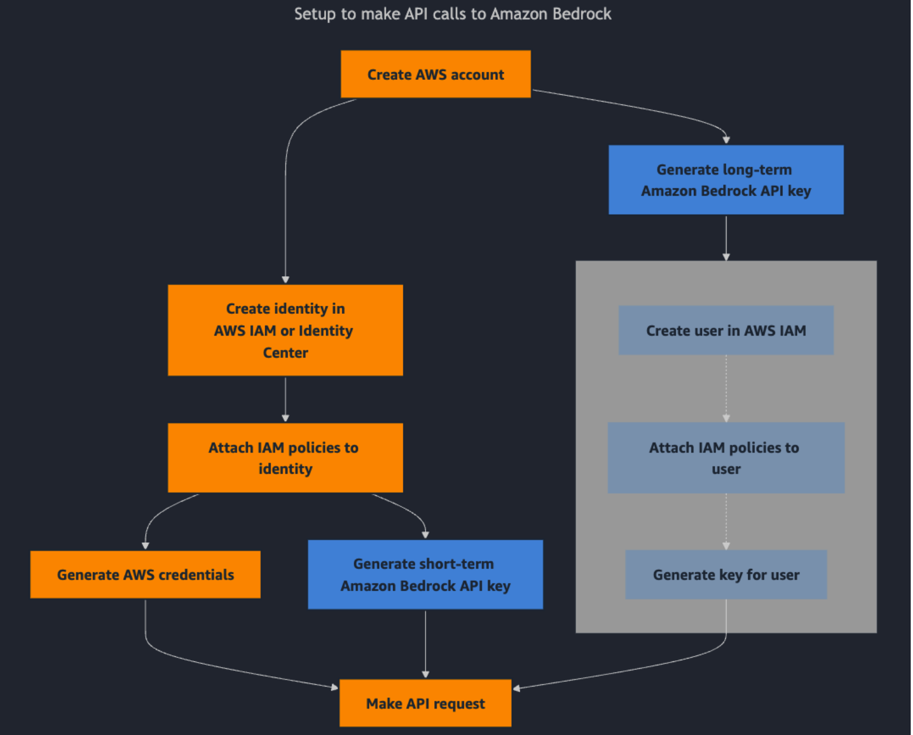

 IAM = Identity and Access Management
Here we create users and groups and assign permissions to them.
For each of the granular activities & task we can create a policy and assign it to a user or group. Example: 
    - Examples include: Model Invocation- Allowing actions like bedrock:InvokeModel and bedrock:InvokeModelWithResponseStream on specific model ARNs
    - For **Knowledge Base Management like RAG**: Permissions such as bedrock-agent:CreateKnowledgeBase, bedrock-agent:StartIngestionJob, bedrock-agent:GetKnowledgeBase, 
    - Bedrock Console → Request model access (Claude, Nova, Llama)bedrock-agent-runtime:RetrieveAndGenerate are needed
AmazonBedrockFullAccess (AWS managed policy) this gives full access to all bedrock services.

#run control shift v to show the image 

# Correct Step to Enable Cloud Watch Logs for Bedrock:
# AWS Bedrock Setup Process

## Prerequisites
- **Choose target region** (e.g., us-east-2) - stick to this throughout in **my set up**

## Step 1: IAM Setup (Global)
1. Create IAM user group with policies:
   - AmazonBedrockFullAccess
   - AmazonS3FullAccess
   - AmazonECS_FullAccess (Fargate)
   - AmazonSageMakerFullAccess
   - CloudWatchLogsFullAccess
   - IAMReadOnlyAccess
2. Create IAM user, add to group
3. Enable console access + MFA
4. Create access keys for programmatic access

## Step 2: Bedrock Setup
1. Go to Bedrock console in chosen region
2. Request model access (Claude, Titan, etc.)
3. Wait for approval

## Step 3: Logging Setup (Optional)
### CloudWatch Prerequisites
1. Create CloudWatch log group in same region
2. Create IAM service role with:
   - **Trust relationship**: bedrock.amazonaws.com principal
   - **Policy**: logs:CreateLogStream, logs:PutLogEvents permissions
   - **Condition**: Correct region in SourceArn

### S3 Prerequisites (if using)
1. Create S3 bucket in same region
2. Configure bucket policy for Bedrock access

### Enable Logging
1. Bedrock → Settings → Model invocation logging
2. Select log destinations (CloudWatch/S3)
3. Use pre-created log group and service role
4. Save configuration

## Critical Success Factors
- **Same region** for all resources (Bedrock, CloudWatch, S3)
- **Correct IAM trust relationship** with proper region in SourceArn
- **Pre-create** CloudWatch log groups before enabling logging
- **Service roles** separate from user IAM accounts

## Common Pitfalls
- Region mismatches between resources
- Missing trust relationships on service roles
- Trying to auto-create resources that need manual setup
- Using root account instead of IAM user for daily work

### Federated Users:
- federated users are you can use existing user identities from AWS Directory Service, from your enterprise user directory, or from a web identity provider.  
- 

