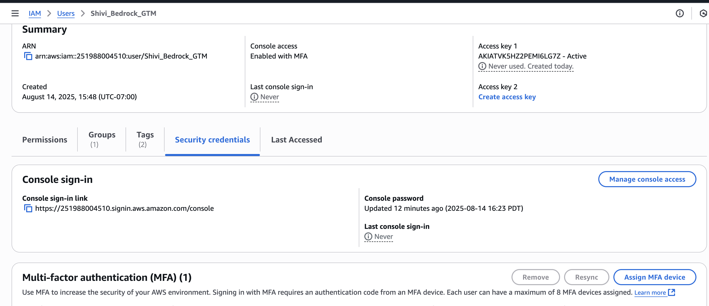

MFA = Multi-Factor Authentication. Adds phone/app-based verification for extra security.
This needs to be added to users , we then give permission to users this is whre we add MFA and access keys and tokens. 
