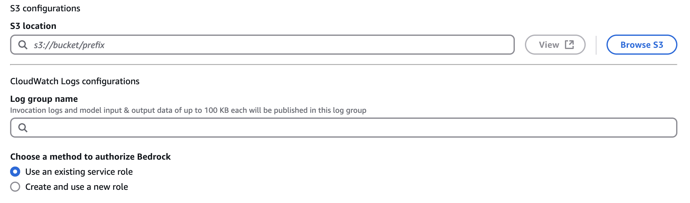

# model invocation logging to collect metadata, requests, and responses for all model invocations in your account.
Model invocation logging records all your Bedrock API calls including:

What prompts you sent
Model responses received
Timestamps, user info, model used
Request/response metadata

Use cases:

Debugging issues
Monitoring usage/costs
Compliance auditing
Performance analysis

Privacy note: All your conversations with models get logged, so consider data sensitivity.
Recommendation: Enable if you need tracking/auditing, skip if privacy is a concern.

Storage location:

CloudWatch Logs (you choose the log group)
S3 bucket (if you configure it)

# this is how you create an s3 for logging:     

