# 1. How does repsonse api work in bedrock: 
    - modelSummaries is Bedrock’s own API response field name,
    - when we call response = bedrock_mngt.list_foundation_models():
        - AWS Bedrock returns a JSON-like Python dictionary. Its structure is defined by AWS,
        - and it contains a list of model summaries under the 'modelSummaries' key.
        - example: 
        ```python
        {
            'modelSummaries': [
                {
                    'modelId': 'amazon.titan-tg1-large',
                    'modelName': 'titan-tg1-large',
                    'providerName': 'Amazon'
                },
                {
                    'modelId': 'anthropic.claude-v3',
                    'modelName': 'claude-v3',
                    'providerName': 'Anthropic'
                },
                ...
            ]
        }
        ```
 ########################################################

# 2. NoVA family of model: how they need to be called in api call: 
    - use an OpenAI-like chat format
    - When we  talk to any Bedrock model , bedrock does not see python 
    - Bedrock only understands JSON in a specific format for that model
    - example: 
 {
  "messages": [
    {
      "role": "user",
      "content": [
        { "text": "Seattle has slight rain today." }
      ]
    }
  ],
  "inferenceConfig": {
    "maxTokens": 200,
    "temperature": 0.3,
    "topP": 0.9
  }
}

    - messages → required top-level list of messages in the conversation.
    - role → user, assistant, system
    - content → list of content blocks ,might include text, image, embedding etc . 

## 2.1. However, till here This is NOT JSON yet — it’s just a Python dictionary in memory.

### 2.2. Then we convert this into json.dumps (body=???)

## 2.3. here the body parameter must be a JSON string


# 2.4. now, json.dumps(payload) does the translation: it takes our python dict and converts it into JSON-formatted string

# 2.5. What Bedrock sends back:
    - Bedrock replies with another JSON object — but in raw bytes form because it’s coming over HTTP.
    - Step 5 — .read() and json.loads(...)- this is whre we read the data 
        - response["body"].read()

        Then: 
        - json.loads
            - takes the JSON string inside those bytes and turns it back into a Python object

### 2.6. This is how it works: 

    output: top-level container for the model’s generated reply. This is the AI reply 

    message: the actual assistant message object (role, content).

    content: list of “content blocks” — Nova supports multiple per message (text, images, tool calls).

    [0]: get the first content block — in simple text chats, that’s the only one.

    ["text"]: actual text string the model wrote.
--- 

# Overall Diagram & Flow: 

```mermaid
flowchart LR
  A["Build Python dict payload<br/>messages + inferenceConfig"]
    --> B["json.dumps(payload)<br/>dict &#8594; JSON string"]
  B --> C["bedrock.invoke_model<br/>contentType=application/json<br/>accept=application/json"]
  C --> D["HTTP response body (bytes)"]
  D --> E[".read() &#8594; raw bytes"]
  E --> F["json.loads(...)<br/>JSON &#8594; Python dict"]
  F --> G["data.output.message.content<br/>(list of blocks)"]
  G --> H["Extract text<br/>join all text blocks"]

```


# Streaming Data (Invoke Model with Streaming Response):
## Step 1 — 
When Nova streams a response, it doesn’t send the full text all at once.
Instead, it sends pieces of the response in events.

One of those event types is called **contentBlockDelta.**

## Step 2 — What is a "content block"?
A content block = one logical piece of the model’s answer:
### Examples:
    - A paragraph of text
    - An image
    - A table
    - A tool call
**Nova labels each block with a number: contentBlockIndex.**
__If you’re streaming plain text, you typically only have block 0__

## Step 3 — What is contentBlockDelta?
  - This is the event type Nova uses to say:
    - “I am adding more stuff to block X of my answer.” where block X is the next word in a sentence 
    - It’s not the data itself — it’s the envelope carrying:
    - Which block is being updated (contentBlockIndex) i.e. next word 
    - The actual update (delta)

## Step 4 — What is delta?
Inside contentBlockDelta, the "delta" field is the actual new content for that block.

  - For text output:

    - "delta": { "text": "Bedrock" } here bedrock is the next word 
      - means:
        - Append "Bedrock" to the text you’ve already collected for this block.
        - same process for the next set of words 

