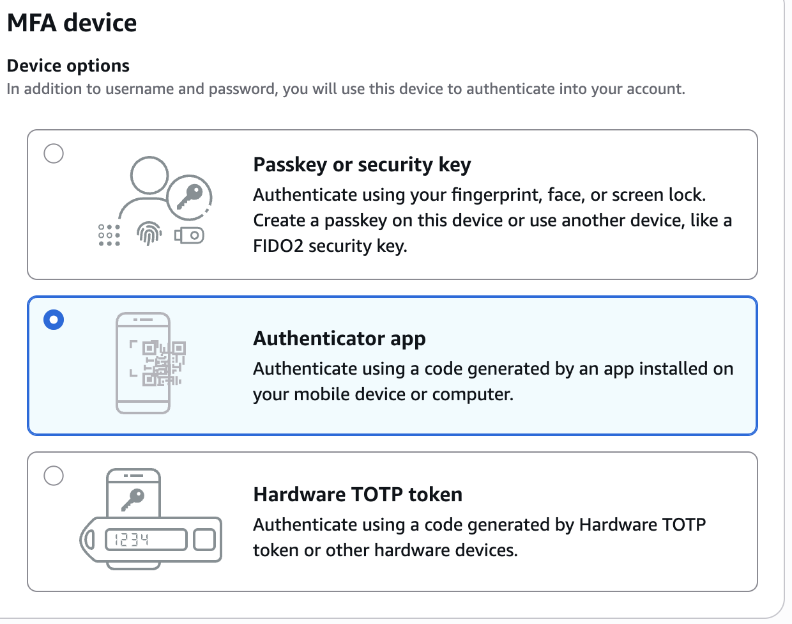
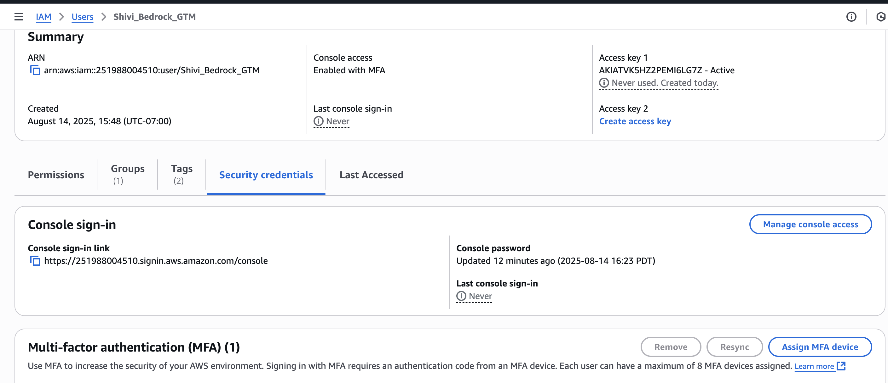

What these are:
**Users:**

Individual people who access AWS
Each user gets unique Access Key ID + Secret Access Key
You create a user for yourself here, in my case i created a user for my personal shivibhatia@ymail.com account 

**Roles:**

Temporary permissions that services/applications can "assume"
Example: Lambda function assumes a role to call Bedrock
Example: EC2 instances call Bedrock → EC2 instance role needs Bedrock permissions
More secure than hardcoded keys

Policies:
JSON documents that define permissions
Example: "Allow bedrock:InvokeModel on Claude models"
Attached to users or roles

__IMPORTANT__:
You can create different groups with different permission levels:
Admin group: Full access policies (like yours). **for my user name in bedrock team, i created a group Shivi_GTM_Account and created a user shivibha@amazon.com on it**
Developer group: Bedrock + S3 access
Analyst group: Read-only access

*** Add MFA ***
- from here once the user is created, we can add MFA to it.
- Below are the options for MFA:
- 

*** For SDK/ CLI access:***
- enable Programmatic access via __Access Keys__ from Users -> Security Credentials -> Create Access Key
- 
- here we have few options: 
    - Access keys : Universal AWS API access for all services (CLI, SDKs, general programming)
    - Bedrock API keys: Only for Bedrock service calls
    - SSH/HTTPS Git credentials: Only for CodeCommit Git repositories
    - X.509 certificates: For specific authentication protocols

**User-level assignment**:
Each user gets specific policies based on their job
Developer: Bedrock + S3 access only
Admin: Full access
Analyst: Read-only access

**Group-level assignment**:

Create groups (Developers, Admins, Analysts)
Attach policies to groups
Add users to appropriate groups
Users inherit group permissions

__There are atleast 1300 policies in AWS__:
1. AWS Managed Policies (~800):
    - Pre-built by AWS for common use cases
    - Examples: AmazonBedrockFullAccess, AmazonS3ReadOnlyAccess, PowerUserAccess
    - AWS maintains and updates these policies
    - Can be attached to users, groups, or roles
2. Customer Managed Policies (~500):
    - Created by you for custom use cases
    - Examples: CustomBedrockAccess, CustomS3Access
    - You maintain and update these policies
    - Can be attached to users, groups, or roles
3. Service Control Policies (SCPs) (~500):
    - Created by you for custom use cases
    - Examples: CustomBedrockAccess, CustomS3Access
    - You maintain and update these policies
    - Can be attached to users, groups, or roles

**NOTE: IMP: Better to use AmazonBedrockFullAccess for Bedrock-only access.DO NOT HAVE ADMIN ACCESS AS ADMIN GIVES ADMIN ACCESS TO ALL OF AWS**